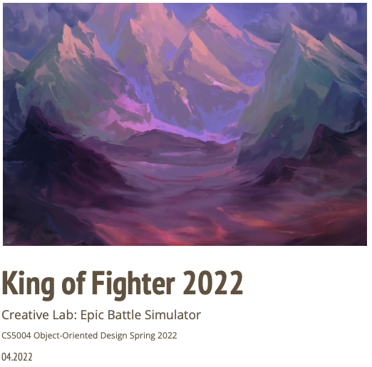

# King of Fighters Creative Lab

King of Fighters is a creative lab assignment for CS5004 Object Oriented Design course in Srping 2022. It is structured as a JavaFX project using JavaFX Scene Builder for generation of fxml file for each scene.

## Installation and Usage

Refer to Chapter 3 JavaFX Project configuration in Creative Lab Manual.pdf

## Demo Video

https://youtu.be/XpVx59h85ys

## Authors

- [@ruohandang](https://github.com/ruohandang)
- [@alyssayyang](https://github.com/alyssayyang)
